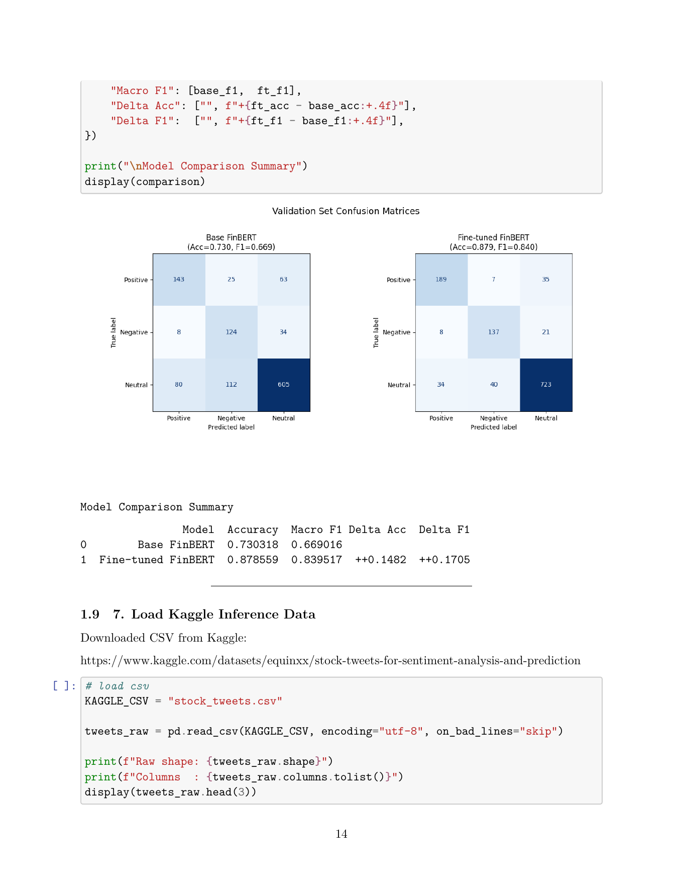
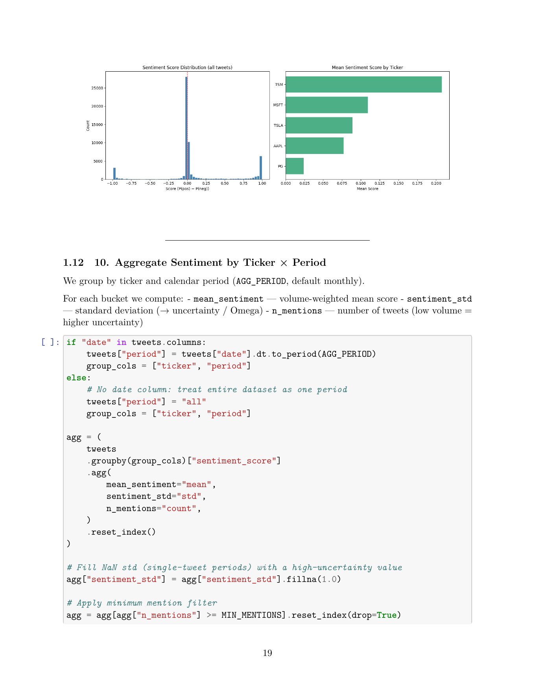
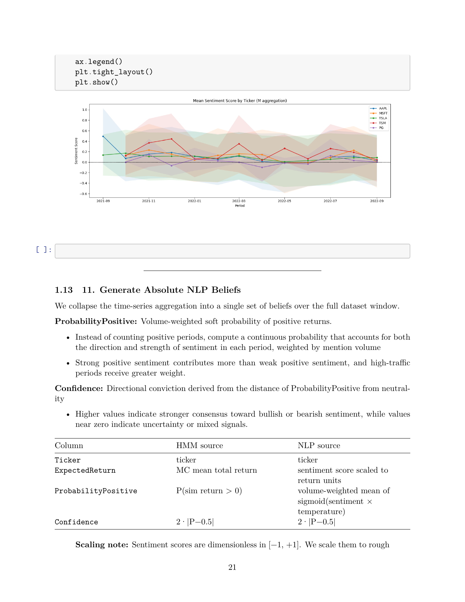
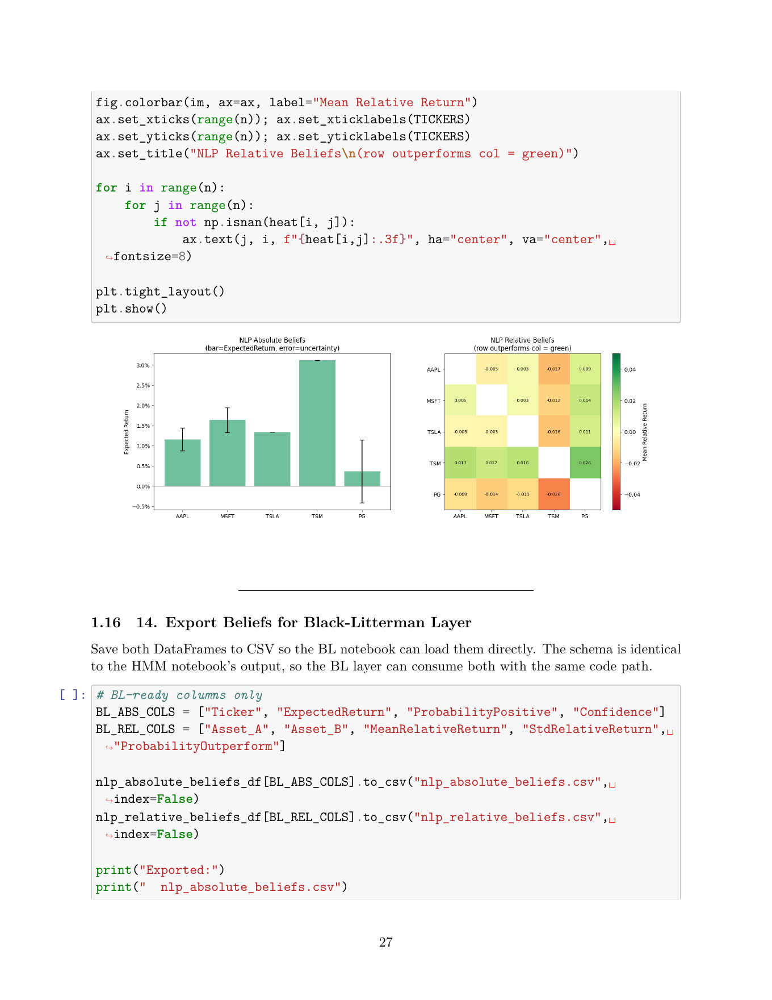
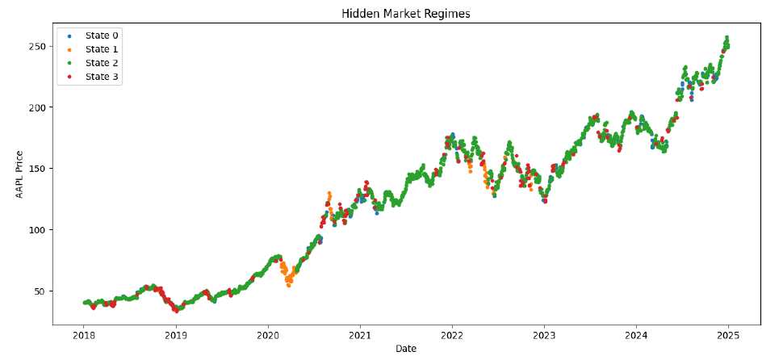
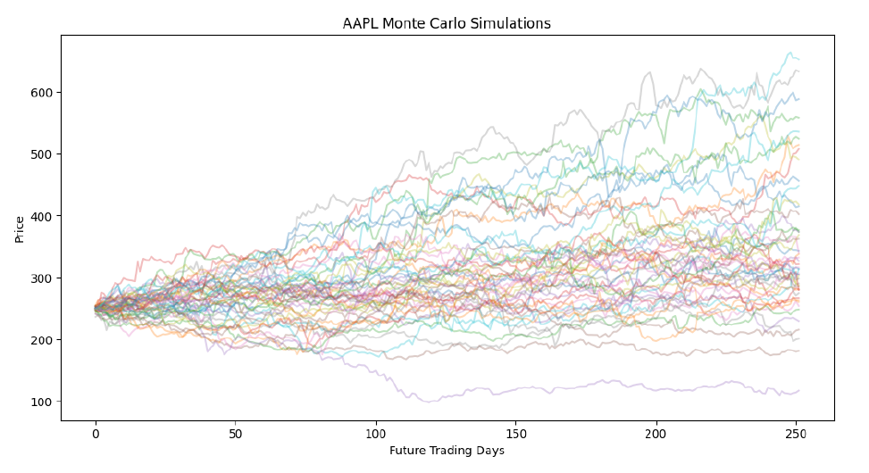
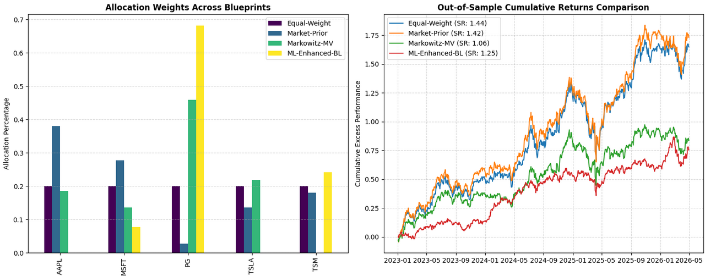

# Priors Over Portfolios: Machine-Learning-Enhanced Black-Litterman Portfolio Optimization

**Course:** Bayesian Machine Learning  
**Team:** May the Code Be With You  
**Application Area:** Finance / Portfolio Optimization

## Project Summary

This project builds a Bayesian portfolio optimization pipeline that combines market-implied prior returns with machine-learned investor views. The core model is the **Black-Litterman framework**, which updates equilibrium market expectations using uncertain beliefs generated by two models:

1. **Hidden Markov Model (HMM)** - learns market regimes from historical asset returns.
2. **NLP sentiment model** - fine-tunes FinBERT on financial tweet sentiment and converts ticker-level sentiment into return beliefs.

The final posterior expected returns are used to optimize a long-only portfolio and are compared against three baselines:

- Equal-weight portfolio
- Market-cap-weighted prior portfolio
- Markowitz mean-variance portfolio
- Machine-learning-enhanced Black-Litterman portfolio

The main question is:

> Can Bayesian portfolio optimization improve allocation decisions by reconciling market priors with uncertain HMM and NLP-based investor views?

---

## Motivation

Traditional mean-variance optimization is sensitive to noisy expected return estimates. The Black-Litterman model addresses this by starting from market-implied equilibrium returns, then updating those priors with investor views and view uncertainty.

Instead of manually specifying views, this project generates them from machine learning:

- The **HMM** captures latent market regimes such as growth, defensive, or high-volatility periods.
- The **NLP model** captures retail and news sentiment from financial tweets.
- The **Black-Litterman layer** acts as the Bayesian reconciliation mechanism when the two signals disagree.

This makes the project both a portfolio optimization problem and a Bayesian machine learning application.

---

## Asset Universe

The final implementation uses five equities:

| Ticker | Company |
|---|---|
| AAPL | Apple |
| MSFT | Microsoft |
| TSLA | Tesla |
| TSM | Taiwan Semiconductor Manufacturing |
| PG | Procter & Gamble |

These assets provide a mix of growth/technology exposure and a defensive consumer staples asset.

---

## Repository Structure

```text
.
├── README.md
├── notebooks/
│   ├── Bayesian_final_NLP_beliefs.ipynb
│   ├── Bayesian_final_HMM_beliefs.ipynb
│   └── Black_Litterman.ipynb
├── data/
│   ├── stock_tweets.csv
│   ├── hmm_absolute_beliefs.csv
│   ├── hmm_relative_beliefs.csv
│   ├── nlp_absolute_beliefs.csv
│   └── nlp_relative_beliefs.csv
├── assets/
│   ├── nlp_finbert_confusion_matrix.png
│   ├── nlp_sentiment_distribution.png
│   ├── nlp_sentiment_timeseries.png
│   ├── nlp_beliefs_heatmap.png
│   ├── hmm_market_regimes.png
│   ├── hmm_monte_carlo_simulations.png
│   └── bl_allocation_performance.png
└── requirements.txt
```

---

## Data Sources

### Market Data

Daily adjusted closing prices were downloaded using `yfinance` for the selected ticker universe. The price data was transformed into:

- Daily returns
- Log returns for HMM training
- Annualized covariance matrix
- Market-capitalization benchmark weights
- In-sample and out-of-sample return windows

### Text Data

The NLP model uses financial tweet data for sentiment inference.

- Fine-tuning dataset: Twitter Financial News Sentiment (HuggingFace)
- Inference dataset: web-scraped stock tweets from 2021-2022 (Kaggle)
- Final ticker-matched tweet rows: **63,423**

Tweet sentiment is converted into a scalar score:

```text
sentiment_score = P(positive) - P(negative)
```

This produces values in the range `[-1, 1]`, where positive values indicate bullish sentiment and negative values indicate bearish sentiment.

---

## Methodology

## 1. Market Prior Construction

The Black-Litterman prior is based on market-implied equilibrium returns:

```text
Pi = delta * Sigma * w_mkt
```

Where:

- `Pi` = market-implied expected returns
- `delta` = risk-aversion coefficient
- `Sigma` = annualized covariance matrix
- `w_mkt` = market-capitalization weights

### Market-Implied Weights

| Ticker | Market Weight |
|---|---:|
| AAPL | 38.64% |
| MSFT | 26.37% |
| PG | 2.84% |
| TSLA | 13.90% |
| TSM | 18.25% |

### Market-Implied Prior Returns

| Ticker | Prior Expected Return |
|---|---:|
| AAPL | 22.81% |
| MSFT | 20.53% |
| PG | 6.27% |
| TSLA | 37.93% |
| TSM | 21.24% |

---

## 2. NLP Sentiment Beliefs

The NLP component fine-tunes **FinBERT** on labeled financial tweet data, then applies the fine-tuned model to ticker-matched stock tweets.

### NLP Pipeline

1. Load Twitter Financial News Sentiment dataset (for fine-tuning).
2. Remap labels into FinBERT convention: positive, negative, neutral.
3. Fine-tune FinBERT: adapt to tweet-domain financial language.
4. Evaluate fine-tuned FinBERT against base FinBERT.
5. Run inference on 2021-2022 stock tweets --> per-tweet sentiment score.
6. Aggregate sentiment by ticker and month: mean sentiment, std, mention volume
7. Convert sentiment into absolute and relative Black-Litterman views.

### FinBERT Evaluation

| Model | Accuracy | Macro F1 |
|---|---:|---:|
| Base FinBERT | 0.7303 | 0.6690 |
| Fine-tuned FinBERT | 0.8786 | 0.8395 |

The fine-tuned model improved accuracy by about **14.82 percentage points** and macro F1 by about **17.05 percentage points**.



### NLP Sentiment Aggregation

The tweet-level scores were aggregated by ticker and month. The model found generally positive sentiment across the selected tickers, with the strongest average sentiment for TSM and the weakest for PG.





### Final NLP Absolute Beliefs

| Ticker | Expected Return | Probability Positive | Confidence | Total Mentions |
|---|---:|---:|---:|---:|
| AAPL | 1.16% | 72.55% | 45.10% | 12,107 |
| MSFT | 1.63% | 78.26% | 56.51% | 5,984 |
| TSLA | 1.34% | 77.23% | 54.47% | 44,211 |
| TSM | 3.11% | 87.11% | 74.21% | 601 |
| PG | 0.36% | 56.78% | 13.55% | 517 |

### Strongest NLP Relative Views

| View | Mean Relative Return | Probability Outperform |
|---|---:|---:|
| TSM over PG | 2.64% | 84.64% |
| MSFT over PG | 1.40% | 72.81% |
| TSLA over PG | 1.06% | 70.21% |
| AAPL over PG | 0.93% | 67.44% |
| TSM over AAPL | 1.71% | 75.69% |
| TSM over TSLA | 1.57% | 68.98% |



### NLP Interpretation

The NLP signal is useful but imperfect. Tesla had extremely high tweet volume and remained strongly positive despite a large decline during the 2022 bear market, suggesting retail-investor optimism bias. TSM showed very strong sentiment but had much lower mention volume, so its sentiment signal is less reliable.

This is exactly where Black-Litterman is useful: it can include the sentiment view without allowing it to completely dominate the portfolio, because every view is assigned uncertainty.

---

## 3. HMM Market Regime Beliefs

The HMM component uses historical log returns from 2018-2025 to learn latent market states.

### HMM Setup

| Parameter | Value |
|---|---:|
| Number of hidden states | 4 |
| Training period | 2018-01-01 to 2025-01-01 |
| Simulations | 1,000 |
| Forecast horizon | 252 trading days |
| Random seed | 42 |

The model converged after **47 iterations**.

### Hidden State Counts

| State | Count |
|---|---:|
| 0 | 234 |
| 1 | 86 |
| 2 | 1,259 |
| 3 | 181 |



### Monte Carlo Simulation

After fitting the HMM, the model simulated 1,000 future price paths over 252 trading days. These simulations were used to estimate expected returns, probability of positive return, and confidence for each asset.



### Final HMM Absolute Beliefs

| Ticker | Expected Return | Probability Positive | Confidence |
|---|---:|---:|---:|
| AAPL | 36.88% | 80.20% | 60.40% |
| MSFT | 32.17% | 79.20% | 58.40% |
| TSLA | 15.60% | 72.50% | 45.00% |
| TSM | 91.29% | 76.10% | 52.20% |
| PG | 37.56% | 77.20% | 54.40% |

### Strongest HMM Relative Views

| View | Mean Relative Return | Probability Outperform |
|---|---:|---:|
| TSM over PG | 53.72% | 64.10% |
| AAPL over TSLA | 21.27% | 68.10% |
| MSFT over TSLA | 16.57% | 65.10% |
| AAPL over MSFT | 4.70% | 53.00% |
| TSM over TSLA | 75.68% | 69.40% |

---

## 4. Black-Litterman View Integration

The Black-Litterman model combines:

- Market-implied prior returns
- HMM absolute and relative beliefs
- NLP absolute and relative beliefs
- View uncertainty matrix `Omega`

The model uses the standard posterior update:

```text
E[R] = Pi + tau * Sigma * P.T * inv(P * tau * Sigma * P.T + Omega) * (Q - P * Pi)
```

Where:

- `P` = picking matrix that identifies assets in each view
- `Q` = view return vector
- `Omega` = diagonal covariance matrix of view uncertainty
- `tau` = prior uncertainty scaling parameter

A total of **30 views** were integrated:

- 10 HMM relative views
- 5 HMM absolute views
- 10 NLP relative views
- 5 NLP absolute views

---

## 5. Posterior Expected Returns

The Black-Litterman posterior compressed aggressive growth expectations and increased the defensive expected return for PG.

| Ticker | Market Prior Return | BL Posterior Return |
|---|---:|---:|
| AAPL | 22.81% | 12.22% |
| MSFT | 20.53% | 12.63% |
| PG | 6.27% | 11.04% |
| TSLA | 37.93% | 12.18% |
| TSM | 21.24% | 13.84% |

This shift shows the Bayesian update moving the portfolio away from high-volatility growth exposure and toward a more defensive allocation.

---

## Portfolio Optimization

After computing posterior returns, we used a long-only maximum Sharpe ratio optimizer with the constraint:

```text
sum(weights) = 1, weights >= 0
```

### Allocation Comparison

| Ticker | Equal Weight | Market Prior | Markowitz MV | ML-Enhanced BL |
|---|---:|---:|---:|---:|
| AAPL | 20.00% | 38.64% | 18.75% | 3.15% |
| MSFT | 20.00% | 26.37% | 9.91% | 9.83% |
| PG | 20.00% | 2.84% | 34.10% | 66.72% |
| TSLA | 20.00% | 13.90% | 18.06% | 0.00% |
| TSM | 20.00% | 18.25% | 19.18% | 20.29% |

The ML-enhanced BL strategy heavily tilted toward PG because PG had lower volatility while its posterior return became comparable to the growth assets.

---

## Backtesting Results

The strategies were tested on out-of-sample returns beginning in 2025.

| Strategy | Annual Return | Annual Volatility | Sharpe Ratio | Max Drawdown | Turnover | Allocation Stability |
|---|---:|---:|---:|---:|---:|---:|
| Equal Weight | 16.61% | 24.49% | 0.678 | -26.46% | 0.5003 | inf |
| Market Prior | 17.80% | 26.33% | 0.676 | -28.67% | 0.5003 | 69.16 |
| Markowitz MV | 14.83% | 22.04% | 0.673 | -23.69% | 0.7271 | 162.99 |
| ML-Enhanced BL | 9.91% | 15.59% | 0.636 | -13.37% | 1.3185 | 16.83 |



---

## Key Findings

### 1. Black-Litterman acted as a risk-control engine

The ML-enhanced BL portfolio had the lowest volatility and the smallest maximum drawdown. Its max drawdown was **-13.37%**, compared with **-28.67%** for the market-prior portfolio.

### 2. The defensive allocation reduced upside capture

The ML-enhanced BL portfolio returned **9.91%**, below the market-prior return of **17.80%**. This happened because the out-of-sample period favored tech/growth exposure, while the BL posterior had reduced exposure to TSLA and AAPL.

### 3. Sharpe ratio did not improve

Although risk decreased substantially, return also decreased. As a result, the ML-enhanced BL Sharpe ratio was **0.636**, slightly below the market-prior Sharpe ratio of **0.676**.

### 4. Model views created a strong PG tilt

The optimized BL portfolio allocated **66.72%** to PG. This made the portfolio more defensive but also less diversified.

### 5. NLP sentiment contained useful but biased information

FinBERT fine-tuning improved sentiment classification performance, but retail sentiment was not always aligned with realized returns. Tesla sentiment remained bullish despite poor price performance in 2022, showing that text sentiment can reflect investor optimism rather than true forward returns.

---

## Limitations

- The asset universe is small, with only five equities.
- The NLP signal is sensitive to tweet volume and retail-investor bias.
- TSM and PG had much lower tweet counts than TSLA, making their sentiment estimates less stable.
- HMM simulation results can be sensitive to the number of hidden states and training window.
- The optimized ML-BL portfolio became highly concentrated in PG.
- Transaction costs were not explicitly deducted from returns.
- The out-of-sample period was relatively short.

---

## Future Work

- Expand the asset universe to 20-30 equities.
- Add sector ETFs and macro variables such as VIX, Treasury yields, and inflation data.
- Use rolling-window backtesting instead of a single train/test split.
- Add transaction costs and rebalance frequency constraints.
- Calibrate view confidence using historical predictive accuracy.
- Test alternative NLP models such as FinBERT variants, DeBERTa, or LLM-based sentiment scoring.
- Limit portfolio concentration using maximum asset-weight constraints.
- Compare against a standard Black-Litterman model with manually specified views.

---

## How to Run

### 1. Clone the repository

```bash
git clone <repo-url>
cd <repo-name>
```

### 2. Install dependencies

```bash
pip install -r requirements.txt
```

Recommended packages:

```text
numpy
pandas
matplotlib
scipy
scikit-learn
yfinance
hmmlearn
transformers
datasets
torch
kaggle
```

### 3. Run the notebooks in order

```text
1. Bayesian_final_NLP_beliefs.ipynb
2. Bayesian_final_HMM_beliefs.ipynb
3. Black_Litterman.ipynb
```

The NLP and HMM notebooks export belief CSV files. The Black-Litterman notebook reads those files and produces the final posterior returns, optimized weights, and backtest results.

---

## Team Contributions

| Team Member | Main Responsibility | Contribution |
|---|---|---|
| Jenny Lee | NLP beliefs | Built the NLP sentiment pipeline, fine-tuned FinBERT, generated ticker-level sentiment scores, and exported NLP absolute/relative Black-Litterman views. |
| Jack Morgan | HMM beliefs | Built the Hidden Markov Model pipeline, trained market regime detection, ran Monte Carlo simulations, and exported HMM absolute/relative views. |
| Noah Tan | Black-Litterman | Implemented the Black-Litterman integration layer, constructed prior/posterior expected returns, parsed view matrices, and built the optimization engine. |
| Ryusei Leon Nakano | Backtesting, GitHub, presentation prep | Helped evaluate strategies using out-of-sample performance metrics, organized project materials, and prepared the repository/presentation structure. |
| Nomunbileg Sukhbold | Backtesting, GitHub, presentation prep | Helped evaluate strategy performance, organize project outputs, write documentation, and prepare the final GitHub repository/presentation. |

---

## Conclusion

This project shows how Bayesian machine learning can be used to combine market priors with uncertain model-generated views. The HMM and NLP models produced different types of signals: one based on market regimes and one based on sentiment. The Black-Litterman framework provided a principled way to combine those signals into posterior expected returns.

The final ML-enhanced BL portfolio did not produce the highest return or Sharpe ratio, but it substantially reduced volatility and maximum drawdown. This suggests that the framework was most effective as a **risk-management and capital-preservation system**, rather than an aggressive return-maximization strategy.
